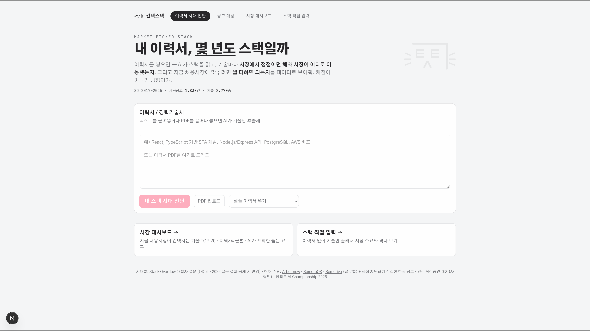
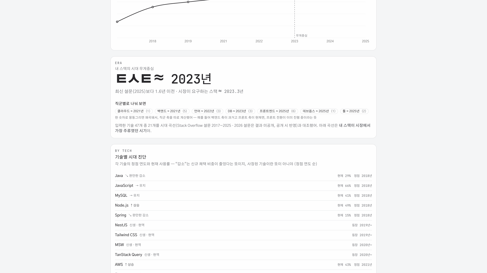
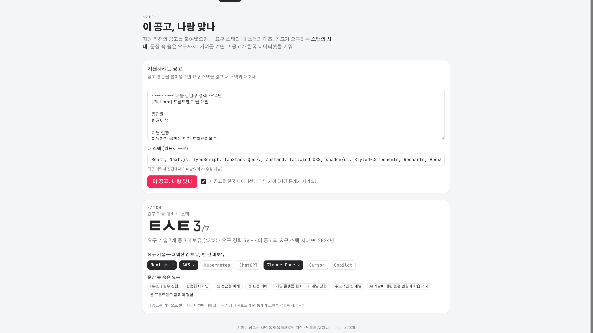
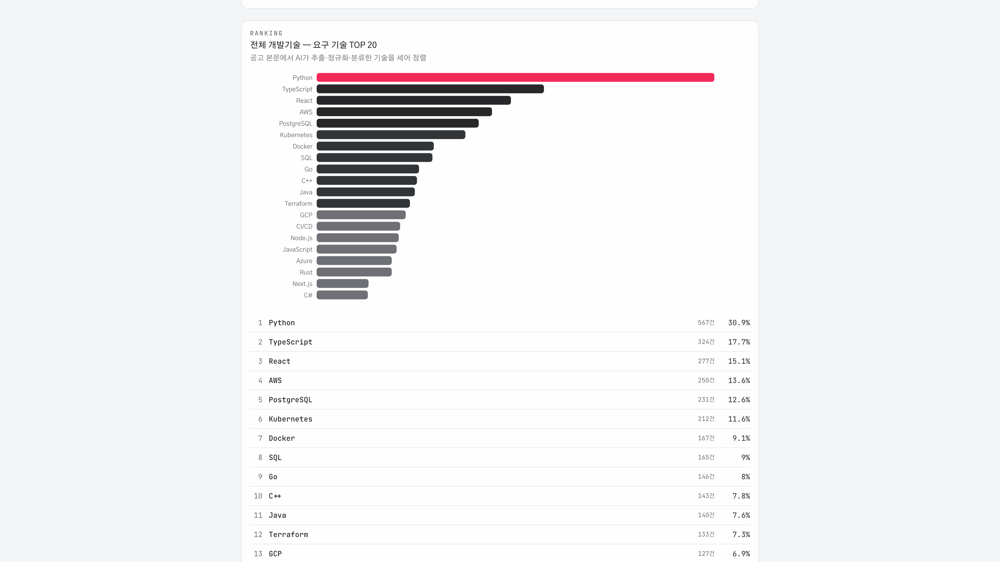
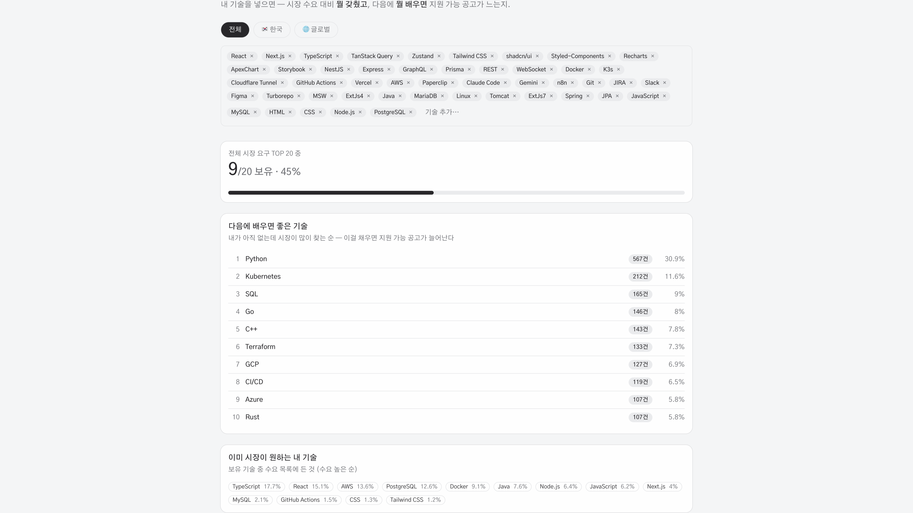

# (ㅌㅅㅌ) 간택스택 — 내 이력서, 몇 년도 스택일까

> 이력서를 넣으면 AI가 스택을 읽고, **내 기술이 시장에서 몇 년도에 머물러 있는지**와
> **지금 채용시장에 맞추려면 뭘 더하면 되는지**를 데이터로 보여줍니다. 채점이 아니라 방향.

- **라이브**: https://gantaek.doyosae.com
- 원티드 AI Championship 2026 출품작 · 제출 문서: [docs/SUBMISSION.md](docs/SUBMISSION.md)



---

## 왜 만들었나

2026년 프론트엔드 구직자로서 29개 회사에 지원하며 두 질문에 계속 부딪혔습니다.

1. *"내 스택, 아직 팔리는 건가?"* — 이력서 속 기술이 시장 기준으로 현재인지 과거인지 알 길이 없다
2. *"뭘 배워야 하나?"* — 유행이 아니라 **채용시장이 실제로 요구하는 것**이 궁금하다

공고를 보여주는 서비스는 많지만, 공고가 요구하는 기술을 **구조화된 데이터로 바꿔
개인의 이력서와 같은 자로 대조해주는 것**은 없었습니다. 그래서 만들었습니다.

## 어떻게 동작하나 — 3축 구조

세 데이터가 같은 기술 어휘(정규화 사전)로 통일되어 자유롭게 대조됩니다.

```
[시대축]   Stack Overflow 설문 2017~2025      "이 기술은 몇 년도에 주류였나"
[수요축]   채용공고 1,800+건 (공개 API 7종)     "지금 시장이 뭘 원하나"
[개인축]   이력서 (Gemini 구조화 추출)          "나는 뭘 갖고 있나"
```

핵심 계산 — **시대 무게중심**: 각 기술의 사용률 정점 연도를 시대 판별력(곡선 변동폭)으로
가중평균. 늘 1위인 기술(JavaScript)은 시대 신호가 약해 낮게 반영되고, jQuery↓·Docker↑처럼
곡선이 가파른 기술이 시대를 결정합니다. 설문에 없는 신생 기술(Zustand·TanStack 등)은
공개 릴리스 연도 기반 "최신 신호"로 반영. 같은 계산을 공고에도 적용해
**"시장이 요구하는 스택의 시대"**(현재 ≈2023년)와의 실질 격차를 잽니다.

## 화면

| | |
|---|---|
| [](docs/screenshots/02-diagnosis.png) | [](docs/screenshots/03-match.png) |
| [](docs/screenshots/04-market.png) | [](docs/screenshots/05-gap.png) |

*클릭하면 전체 페이지 캡처*

| 화면 | 하는 일 |
|---|---|
| **이력서 시대 진단** `/` | 이력서/PDF → 스택 추출 → 무게중심 연도·직군별 축·주류도 곡선 → 기술별 진단(정점·추세·후계) → 다음 걸음 추천 → AI 총평. URL·이미지 카드 공유 |
| **공고 매칭** `/match` | 지원 직전 공고 붙여넣기 → 요구 스택 × 내 스택 대조, 공고의 요구 시대(레거시 팀 감지), 숨은 요구. 옵트인 기여 시 한국 데이터셋이 자람 |
| **시장 대시보드** `/market` | 요구 기술 TOP 20(지역×직군) · 시장 요구 시대 분포 · AI가 포착한 숨은 요구 |
| **스택 직접 입력** `/gap` | 이력서 없이 기술만 골라 시장 격차 확인 |

## AI를 어떻게 썼나

**LLM은 판정자가 아니라 구조화 계층입니다.**

- Gemini 3.6 Flash(structured output)가 하는 일: 공고·이력서라는 **비정형 텍스트를 정형
  데이터로** (기술+카테고리+연차+숨은 요구), 그리고 진단 수치를 **사람의 언어로**(총평)
- AI가 하지 않는 일: 무게중심·집계·추천 순위 — 전부 결정론적 코드. 같은 입력이면 항상
  같은 결과라 진단이 재현 가능합니다

## 데이터 — 전부 합법

- **시대축**: [Stack Overflow Developer Survey](https://survey.stackoverflow.co) 2017~2025 (ODbL 1.0)
- **공고**: [Arbeitnow](https://www.arbeitnow.com) · [RemoteOK](https://remoteok.com) · [Remotive](https://remotive.com) · [Jobicy](https://jobicy.com) · [The Muse](https://www.themuse.com) · HN Who is hiring (Algolia 공개 API) — **크롤링 없음**
- **한국**: 공공데이터포털(재정경제부 공공기관 채용) + 직접 지원하며 수집한 공고 + 유저 기여
- 이력서는 저장하지 않습니다. 기여 공고는 익명·통계 목적으로만.

## 디자인 시스템

자체 제작 — 규칙 문서: [docs/DESIGN-SYSTEM.md](docs/DESIGN-SYSTEM.md)

- **마크 "(ㅌㅅㅌ)"**: 간택스택 초성에서 ㄱ이 머리(이마+옆윤곽)가 되고, 남는 ㅌㅅㅌ이 얼굴.
  눈 ㅌ의 3단 획 = 지표 막대와 같은 어휘
- **표정 4종이 서비스 상태에 1:1 매핑**: ㅌㅅㅌ 기본/격차 · ㅡㅅㅡ 로딩/빈화면 · ㅇㅅㅇ 발견/총평 · ^ㅅ^ 달성(남용 금지)
- **라즈베리(#F32859) 단일 액센트, 화면당 한 곳** — 홈=진단 버튼, 진단=곡선의 격차 구간, 대시보드=1위 막대. 나머지는 차콜 3단
- 그림자·그라디언트·스피너·카운트업 금지. 숫자와 기술명은 전부 JetBrains Mono.
  **데이터는 건조하게, 반응은 고양이가.**

## 스택

Next.js 16 (App Router·standalone) · TypeScript · Prisma + PostgreSQL ·
Gemini 3.6 Flash · Tailwind CSS 4 + shadcn/ui · Recharts ·
홈랩 k3s (traefik + cert-manager) · GitHub Actions CI/CD · 일일 수집 CronJob

## 실행

```bash
pnpm install
docker run -d --name gantaek-pg -p 5433:5432 -e POSTGRES_PASSWORD=postgres postgres:16
cp .env.example .env            # DATABASE_URL·GEMINI_API_KEY 채우기
pnpm exec prisma migrate deploy
pnpm exec tsx scripts/seed.ts   # 공고 수집+AI 추출 (키 없으면 키워드 폴백)
pnpm dev
```

배포 런북: [docs/DEPLOY.md](docs/DEPLOY.md)

---

만든 사람: [@DoyoSaee](https://github.com/DoyoSaee) — 기획·디자인 시스템·데이터 파이프라인·AI 통합·배포까지 1인 빌드 (Claude Code 페어)
